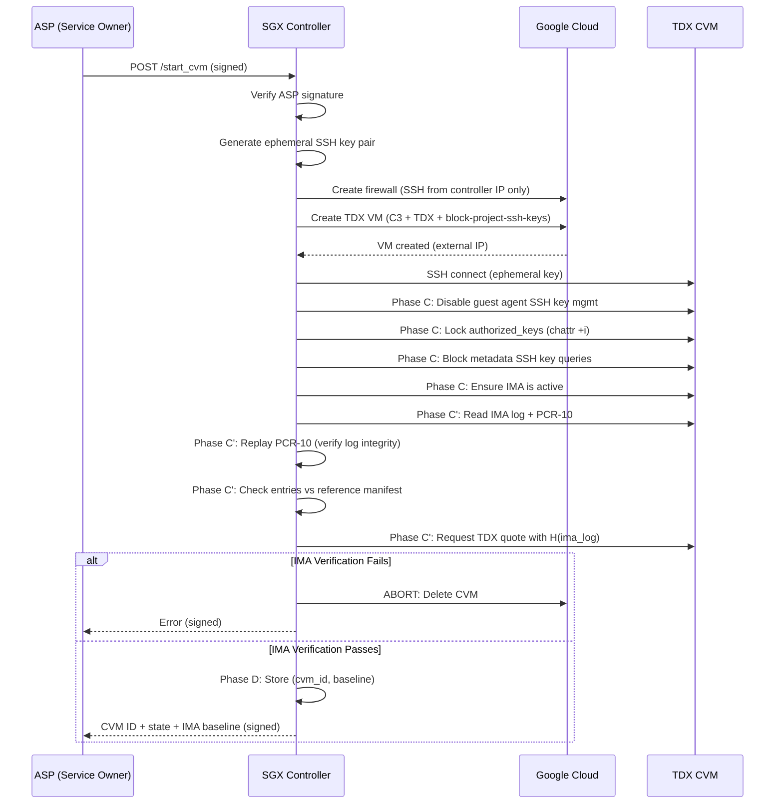

# CVM Commissioning Phase — TDX on GCP via SGX Controller

This module implements the **commissioning (launch) phase** of the SGX-TDX composition protocol. An SGX enclave acts as a trustworthy controller that provisions and exclusively manages TDX Confidential VMs on Google Cloud Platform.

Based on [Duet](https://github.com/Nokia-Bell-Labs/tee-duet) (SysTEX 2024), adapted for Google Cloud + Intel TDX.

## Architecture

```
   ┌─────────┐         ┌──────────────────┐         ┌──────────────────┐
   │   ASP   │ ──────▶ │  SGX Controller  │ ──────▶ │  TDX CVM (GCP)  │
   │ (Client)│ signed  │  (Flask/Gramine) │  SSH    │  (C3 series)    │
   └─────────┘ request └──────────────────┘ (only)  └──────────────────┘
                              │                           │
                        Generates SSH key            SSH public key
                        pair INSIDE enclave           injected via
                        (private key never            GCP metadata
                         leaves enclave)
```

### Security Properties

1. **SGX-exclusive SSH access** — Ephemeral RSA key pair generated inside the SGX enclave. The private key never leaves the enclave. Only the controller can SSH into the CVM.
2. **Firewall restriction** — GCP firewall rule restricts SSH to the controller's IP only.
3. **Guest agent SSH hardening** — Disables GCP guest agent SSH key management to prevent IAM-based key injection (see below).
4. **IMA-based launch integrity** — After hardening, the controller verifies the CVM's IMA log to detect post-boot tampering (malicious services, trojanized libraries, unauthorized kernel modules).
5. **ASP authentication** — Privileged operations require RSA-PSS signatures from the ASP's private key.
6. **Controller attestation** — The ASP verifies the SGX controller's quote before trusting it.
7. **Audit trail** — All CVM commands logged with SHA-256 hashes.

### Preventing GCP Metadata SSH Key Injection

> **Attack vector (not addressed by Duet):** Inside any GCP VM, the guest agent periodically queries `http://metadata.google.internal/computeMetadata/v1/` for SSH keys and updates `~/.ssh/authorized_keys`. If someone with GCP project IAM access adds an SSH key via the API or Console, the guest agent will pick it up — bypassing SGX-exclusive SSH access.

**Our multi-layered mitigation:**

| Layer | Where | What |
|-------|-------|------|
| VM metadata | `gcp_client.py` | `block-project-ssh-keys=TRUE`, `enable-guest-attributes=FALSE`, `enable-oslogin=FALSE` |
| SSHD config | `tdx_cvm_setup.sh` | Disables `google_authorized_keys` command in sshd_config |
| Guest agent | `tdx_cvm_setup.sh` | Disables account manager daemon (`AccountManager.disable=true`) |
| File system | `tdx_cvm_setup.sh` | `chattr +i` on `authorized_keys` (immutable, even root can't modify) |
| Network | `tdx_cvm_setup.sh` | iptables rule blocks metadata SSH key queries |

## Quick Start

### 1. Install Dependencies

```bash
cd commissioning_phase
pip3 install -r requirements.txt
```

### 2. Configure GCP

```bash
cp gcp_config.env.template gcp_config.env
# Edit gcp_config.env with your GCP project details
```

**Requirements:**
- GCP project with Compute Engine API enabled
- Service account with `compute.admin` role (or fine-grained VM/firewall permissions)
- C3 machine type quota in your zone
- TDX-capable zone (e.g., `us-central1-a`, `europe-west4-a`)

### 3. Generate ASP Keys

```bash
python3 -m commissioning_phase.generate_asp_keys
```

This creates:
- `commissioning_phase/asp_private_key` — Keep secret (ASP's signing key)
- `commissioning_phase/asp_pub_keys/asp_private_key.pub` — Loaded by the controller

### 4. Start the Controller

```bash
# Direct mode (development, no SGX hardware):
python3 -m commissioning_phase.sgx_controller -t direct

# SGX mode (inside Gramine-SGX):
python3 -m commissioning_phase.sgx_controller -t sgx
```

### 5. Launch a CVM

```bash
# Start a TDX CVM
python3 -m commissioning_phase.asp_client --action start-cvm

# Run commands on the CVM
python3 -m commissioning_phase.asp_client --action run-commands \
    --cvm-id <CVM_ID> --command "uname -a"

# Mark CVM as in-service (blocks further commands)
python3 -m commissioning_phase.asp_client --action mark-cvm \
    --cvm-id <CVM_ID> --cvm-mode in-service

# Get CVM state
python3 -m commissioning_phase.asp_client --action get-cvm-state \
    --cvm-id <CVM_ID>

# Stop and delete CVM
python3 -m commissioning_phase.asp_client --action stop-cvm \
    --cvm-id <CVM_ID>
```

## API Endpoints

| Endpoint | Method | Auth | Description |
|----------|--------|------|-------------|
| `/quote` | GET | None | Get SGX quote + controller public key |
| `/start_cvm` | POST | ASP signature | Launch a new TDX CVM on GCP |
| `/run_commands` | POST | ASP signature | Execute commands on CVM (in-update mode only) |
| `/mark_cvm` | POST | ASP signature | Toggle CVM between in-update / in-service |
| `/get_cvm_state` | POST | None | Get CVM state and command audit trail |
| `/stop_cvm` | POST | ASP signature | Stop CVM and delete GCP resources |
| `/get_ima_baseline` | POST | None | Get IMA verification baseline for a CVM |

## File Structure

```
commissioning_phase/
├── __init__.py
├── sgx_controller.py           # Flask server (SGX controller)
├── asp_client.py                # ASP client (service owner)
├── gcp_client.py                # GCP VM provisioning
├── cvm.py                       # CVM model (SSH, command exec)
├── ima_verifier.py              # IMA verification (Phase C')
├── generate_reference_manifest.py  # Generate IMA reference manifest
├── reference_manifest.json      # Known-good file hashes (allowlist)
├── generate_asp_keys.py         # RSA key generation for ASP
├── gcp_config.env.template      # GCP configuration template
├── tdx_cvm_setup.sh             # Initial CVM setup + SSH + IMA hardening
├── test_ima_verifier.py         # Unit tests for IMA verification
├── requirements.txt             # Python dependencies
├── README.md                    # This file
└── utils/
    ├── __init__.py
    ├── crypto.py                # RSA crypto utilities
    └── encoding.py              # Base64/serialization helpers
```

## CVM Commissioning Flow



## IMA-Based Launch Integrity Verification (Phase C')

After SSH hardening (Phase C), the controller verifies the CVM's post-boot integrity using Linux IMA:

1. **IMA Log Replay** — Reads the IMA measurement log and PCR-10 from the CVM. Replays the extend chain to verify the log hasn't been truncated or tampered with.
2. **Reference Manifest Check** — Every file executed during boot is checked against a pre-computed allowlist of known-good hashes. Unknown files abort commissioning.
3. **TDX Quote Binding** — Requests a TDX attestation quote with `report_data = SHA-256(ima_log)`, creating an unforgeable link between IMA state and hardware identity.

### Generating a Reference Manifest

```bash
# From a running known-good CVM via SSH:
python3 -m commissioning_phase.generate_reference_manifest \
    --host <CVM_IP> --user cvm --key <SSH_PRIVATE_KEY_PATH>

# From a local IMA log file:
python3 -m commissioning_phase.generate_reference_manifest \
    --ima-log-file /path/to/ima_log.txt
```

The generated `reference_manifest.json` should be committed alongside the controller code so it's covered by `MRENCLAVE` in SGX mode.

## Testing with a Remote SGX Controller

### Prerequisites

| Component | Requirement |
|-----------|-------------|
| SGX machine | SGX hardware or `direct` mode for development |
| GCP project | Compute Engine API enabled, TDX-capable zone |
| Network | SGX machine can reach GCP VMs on port 22 |
| Service account | `compute.admin` role or VM/firewall permissions |

### End-to-End Test Steps

**Step 1: Generate reference manifest (one-time)**
```bash
# Launch a clean CVM first, then generate the manifest
python3 -m commissioning_phase.generate_reference_manifest \
    --host <CLEAN_CVM_IP> --user cvm --key <SSH_KEY_PATH>
```

**Step 2: Start the controller (on SGX machine)**
```bash
# Direct mode (development):
python3 -m commissioning_phase.sgx_controller -t direct -p 6037

# SGX mode (production):
gramine-sgx python3 -m commissioning_phase.sgx_controller -t sgx -p 6037
```

**Step 3: Launch a CVM with IMA verification (from any machine)**
```bash
python3 -m commissioning_phase.asp_client \
    --url http://<SGX_CONTROLLER_IP>:6037 \
    --action start-cvm
```

The controller will provision the CVM, harden it, run IMA verification, and either return a CVM ID (success) or destroy the CVM (failure).

**Step 4: Verify IMA baseline**
```bash
python3 -m commissioning_phase.asp_client \
    --url http://<SGX_CONTROLLER_IP>:6037 \
    --action get-cvm-state --cvm-id <CVM_ID>
```

Look for `ima_verified: true`, `ima_entry_count`, and `ima_pcr10` in the response.

### Unit Testing (no GCP needed)
```bash
python3 -m commissioning_phase.test_ima_verifier
```

