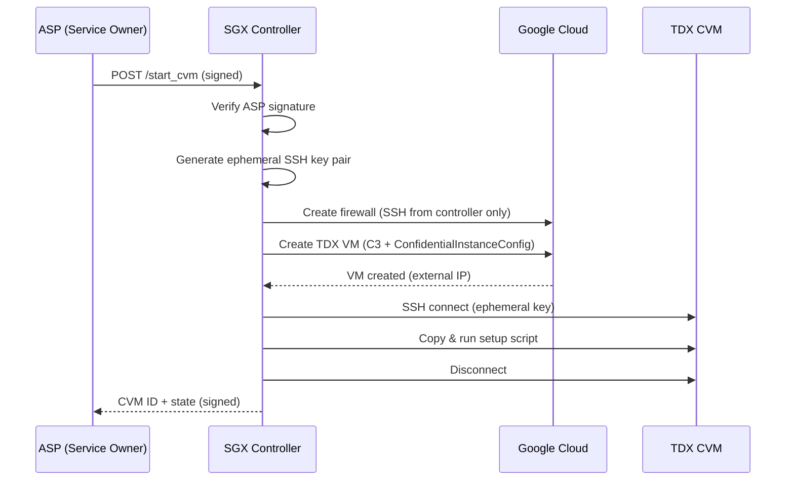

# CVM Commissioning Phase — TDX on GCP via SGX Controller

This module implements the **commissioning (launch) phase** of the SGX-TDX composition protocol. An SGX enclave acts as a trustworthy controller that provisions and exclusively manages TDX Confidential VMs on Google Cloud Platform.

Based on [Duet](https://github.com/Nokia-Bell-Labs/tee-duet) (SysTEX 2024), adapted for Google Cloud + Intel TDX.

## Architecture

```
   ┌─────────┐         ┌──────────────────┐         ┌──────────────────┐
   │   ASP   │ ──────▶ │  SGX Controller  │ ──────▶ │  TDX CVM (GCP)  │
   │ (Client)│ signed  │  (Flask/Gramine) │  SSH    │  (C3 series)    │
   └─────────┘ request └──────────────────┘ (only)  └──────────────────┘
                              │                           │
                        Generates SSH key            SSH public key
                        pair INSIDE enclave           injected via
                        (private key never            GCP metadata
                         leaves enclave)
```

### Security Properties

1. **SGX-exclusive SSH access** — Ephemeral RSA key pair generated inside the SGX enclave. The private key never leaves the enclave. Only the controller can SSH into the CVM.
2. **Firewall restriction** — GCP firewall rule restricts SSH to the controller's IP only.
3. **ASP authentication** — Privileged operations require RSA-PSS signatures from the ASP's private key.
4. **Controller attestation** — The ASP verifies the SGX controller's quote before trusting it.
5. **Audit trail** — All CVM commands logged with SHA-256 hashes.

## Quick Start

### 1. Install Dependencies

```bash
cd commissioning_phase
pip3 install -r requirements.txt
```

### 2. Configure GCP

```bash
cp gcp_config.env.template gcp_config.env
# Edit gcp_config.env with your GCP project details
```

**Requirements:**
- GCP project with Compute Engine API enabled
- Service account with `compute.admin` role (or fine-grained VM/firewall permissions)
- C3 machine type quota in your zone
- TDX-capable zone (e.g., `us-central1-a`, `europe-west4-a`)

### 3. Generate ASP Keys

```bash
python3 -m commissioning_phase.generate_asp_keys
```

This creates:
- `commissioning_phase/asp_private_key` — Keep secret (ASP's signing key)
- `commissioning_phase/asp_pub_keys/asp_private_key.pub` — Loaded by the controller

### 4. Start the Controller

```bash
# Direct mode (development, no SGX hardware):
python3 -m commissioning_phase.sgx_controller -t direct

# SGX mode (inside Gramine-SGX):
python3 -m commissioning_phase.sgx_controller -t sgx
```

### 5. Launch a CVM

```bash
# Start a TDX CVM
python3 -m commissioning_phase.asp_client --action start-cvm

# Run commands on the CVM
python3 -m commissioning_phase.asp_client --action run-commands \
    --cvm-id <CVM_ID> --command "uname -a"

# Mark CVM as in-service (blocks further commands)
python3 -m commissioning_phase.asp_client --action mark-cvm \
    --cvm-id <CVM_ID> --cvm-mode in-service

# Get CVM state
python3 -m commissioning_phase.asp_client --action get-cvm-state \
    --cvm-id <CVM_ID>

# Stop and delete CVM
python3 -m commissioning_phase.asp_client --action stop-cvm \
    --cvm-id <CVM_ID>
```

## API Endpoints

| Endpoint | Method | Auth | Description |
|----------|--------|------|-------------|
| `/quote` | GET | None | Get SGX quote + controller public key |
| `/start_cvm` | POST | ASP signature | Launch a new TDX CVM on GCP |
| `/run_commands` | POST | ASP signature | Execute commands on CVM (in-update mode only) |
| `/mark_cvm` | POST | ASP signature | Toggle CVM between in-update / in-service |
| `/get_cvm_state` | POST | None | Get CVM state and command audit trail |
| `/stop_cvm` | POST | ASP signature | Stop CVM and delete GCP resources |

## File Structure

```
commissioning_phase/
├── __init__.py
├── sgx_controller.py      # Flask server (SGX controller)
├── asp_client.py           # ASP client (service owner)
├── gcp_client.py           # GCP VM provisioning
├── cvm.py                  # CVM model (SSH, command exec)
├── generate_asp_keys.py    # RSA key generation for ASP
├── gcp_config.env.template # GCP configuration template
├── tdx_cvm_setup.sh        # Initial CVM setup script
├── requirements.txt        # Python dependencies
├── README.md               # This file
└── utils/
    ├── __init__.py
    ├── crypto.py            # RSA crypto utilities
    └── encoding.py          # Base64/serialization helpers
```

## CVM Commissioning Flow


