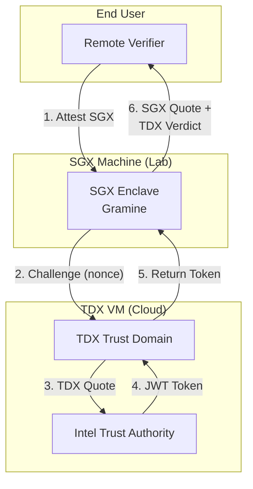

# Security & Privacy Analysis: SGX-TDX Hierarchical Attestation Protocol

> **Review Perspective**: Top-tier security conference (CCS/USENIX Security/S&P) program committee member evaluating this research protocol.

---

## Executive Summary

The SGX-TDX hierarchical attestation protocol proposes a novel composition where an **SGX enclave acts as the verifier/owner of a TDX VM**, establishing a trust chain: `End User → SGX Enclave → TDX VM`. While the approach addresses some real-world challenges—notably platform privacy and attestation bottlenecks—the current implementation has significant security and architectural limitations that must be addressed before it can be considered for production or publication at a top venue.

> [!IMPORTANT]
> **Key Verdict**: The protocol has genuine merit for platform unlinkability and scalability, but the current implementation falls short of providing security improvements over standalone TDX. The value proposition requires careful framing: this is a **privacy-enhancing** composition, not a **security-enhancing** one.

---

## 1. Protocol Architecture Overview



**Trust Chain**: End User trusts SGX enclave (via SGX attestation) → SGX enclave verifies TDX VM → Transitive trust to TDX workload.

---

## 2. Security Analysis

### 2.1 Threat Model Assessment

The protocol documentation lacks a formal threat model. For this review, I reconstruct the implicit assumptions:

| Trust Assumption | Validity | Concern |
|-----------------|----------|---------|
| Intel SGX hardware is secure | ⚠️ Conditional | Speculative execution attacks (Spectre, Foreshadow, LVI) have repeatedly compromised SGX |
| Intel TDX hardware is secure | ⚠️ New technology | Less attack surface exposure due to VM-level isolation, but still relies on Intel TCB |
| Intel Trust Authority (ITA) is trusted | ⚠️ Critical dependency | Single point of failure; ITA compromise affects all attestations |
| TLS channel between SGX and TDX | ✅ Standard | Self-signed certs acceptable for research, production needs proper PKI |
| Cloud provider is honest-but-curious | Assumed | Not explicitly stated; critical for threat model |

> [!CAUTION]
> **Missing Threat Model**: The documentation never states who the adversary is. Is the cloud provider trusted? Can they modify the TDX VM? What about side-channel attacks across the SGX-TDX boundary?

### 2.2 Critical Security Weaknesses

#### 2.2.1 No Cryptographic JWT Signature Verification

**Current Implementation** ([protocol.py#L275-306](file:///home/nkoirala/sgx-tdx-composition-protocol/research/sgx-tdx-attestation/common/protocol.py#L275-306)):
```python
def verify_jwt_simple(token: str, expected_issuer_substring: str = "trustauthority.intel.com"):
    # Only checks issuer string and expiry
    # NO SIGNATURE VERIFICATION
    payload = decode_jwt_payload(token)
    issuer = payload.get('iss', '')
    if expected_issuer_substring not in issuer:
        return False, payload, f"Invalid issuer: {issuer}"
    # ...
```

**Attack**: A malicious TDX server or MITM attacker can forge arbitrary JWT tokens with a fake issuer containing `trustauthority.intel.com`. The SGX enclave will accept them.

**Severity**: 🔴 **CRITICAL** - Completely undermines the attestation guarantee.

**Mitigation Required**: Implement proper JWKS-based signature verification using Intel Trust Authority's public keys.

---

#### 2.2.2 No MRTD Policy Enforcement

**Current Implementation** ([sgx_tdx_verifier.py#L177-180](file:///home/nkoirala/sgx-tdx-composition-protocol/research/sgx-tdx-attestation/sgx-verifier/sgx_tdx_verifier.py#L177-180)):
```python
tdx = payload['tdx']
result.mrtd = tdx.get('tdx_mrtd', '')
result.tcb_status = tdx.get('attester_tcb_status', '')
# Accepts ANY MRTD!
```

**Attack**: A malicious TDX VM with arbitrary code can attest successfully. The SGX enclave has no way to verify that the TDX VM is running expected software.

**Severity**: 🔴 **CRITICAL** - Allows attestation of arbitrary TDX workloads.

**Mitigation Required**: Maintain a whitelist of known-good MRTD values corresponding to verified TDX images.

---

#### 2.2.3 Weak Nonce Binding

**Current Design** ([tdx_attestation_server.py#L106-110](file:///home/nkoirala/sgx-tdx-composition-protocol/research/sgx-tdx-attestation/tdx-server/tdx_attestation_server.py#L106-110)):
```python
cmd = [
    "sudo", "trustauthority-cli", "token", "--tdx",
    "-c", self.config_path,
    "-u", nonce[:32]  # TRUNCATED!
]
```

**Issue**: Only 32 characters (not bytes) of the base64 nonce are used. This means:
- Original nonce: 32 bytes = 256 bits of entropy
- Base64 encoded: ~44 characters
- After truncation: 32 characters = 192 bits of effective binding

**Risk**: While 192 bits is still cryptographically strong, the truncation introduces ambiguity and reduces replay protection margin.

**Severity**: 🟡 **MEDIUM** - Not directly exploitable but reduces security margin.

---

#### 2.2.4 No TCB Policy Enforcement

**Current Behavior**: TCB status is logged but not enforced:
```python
if result.tcb_status not in ("UpToDate", "SWHardeningNeeded"):
    result.warnings.append(f"TCB status: {result.tcb_status}")
# Continues with TRUSTED verdict anyway!
```

**Attack**: Platforms with `OutOfDate` or `Revoked` TCB status are still trusted.

**Severity**: 🟠 **HIGH** - Allows attestation from vulnerable or compromised platforms.

---

### 2.3 Security Properties NOT Provided

| Property | Standalone TDX | SGX-TDX Composite | Analysis |
|----------|---------------|-------------------|----------|
| **Memory Isolation** | ✅ Full VM isolation | ⚠️ Depends on SGX EPC limits | TDX provides better isolation for large workloads |
| **TCB Size** | Smaller (TDX module) | Larger (TDX + SGX + Gramine) | Composition increases attack surface |
| **Side-Channel Resistance** | Better (VM-level) | Worse (enclave-level) | SGX is more vulnerable to side-channels |
| **Attestation Freshness** | ✅ Direct ITA verification | ✅ Nonce binding | Equivalent |
| **Quote Authenticity** | ✅ Cryptographic | ❌ Issuer string only | **Regression** |

> [!WARNING]
> **Security Assessment**: The current SGX-TDX composition provides **weaker security guarantees** than standalone TDX attestation with proper cryptographic verification.

---

## 3. Privacy Analysis

This is where the protocol shows genuine promise.

### 3.1 The Platform Linkability Problem (TDX)

Standard TDX/DCAP attestation exposes platform-identifying fields:

| Field | Location | Linkability Risk |
|-------|----------|------------------|
| `fmspc` | `tdx_collateral.fmspc` | 🔴 Platform family identifier |
| `qeidhash` | `tdx_collateral.qeidhash` | 🔴 Platform-unique QE identity |
| `tcb_date` | `attester_tcb_date` | 🟡 Narrows platform pool |
| `advisory_ids` | `attester_advisory_ids` | 🟡 Reveals security posture |

**Impact** (documented in [PCK_LINKABILITY_ANALYSIS.md](file:///home/nkoirala/sgx-tdx-composition-protocol/research/hierarchical-tee/tdx-layer/attestation/platform-linkability/PCK_LINKABILITY_ANALYSIS.md)):
- Cross-service tracking
- Co-residency detection
- Temporal profiling

### 3.2 How SGX Composition Helps

The hierarchical model enables **privacy proxying**:

```
┌────────────────────────────────────────────────────────────────┐
│  STANDALONE TDX                                                 │
│  [TDX VM] ──full token──▶ [Verifier]                           │
│           (contains FMSPC, QE hash, etc.)                      │
│                                                                 │
│  ⚠️ Verifier learns platform identity                          │
├────────────────────────────────────────────────────────────────┤
│  SGX-TDX COMPOSITION                                            │
│  [TDX VM] ──full token──▶ [SGX Enclave] ──stripped claims──▶   │
│                           (privacy proxy)     [Verifier]       │
│                                                                 │
│  ✅ Verifier only sees: MRTD, RTMRs, TCB bucket, SGX quote     │
└────────────────────────────────────────────────────────────────┘
```

**Key Insight**: The SGX enclave can:
1. Verify the full TDX token (including platform identifiers)
2. Extract only privacy-safe claims (MRTD, RTMRs, debuggable status)
3. Re-sign with the enclave's identity
4. Export an SGX quote embedding the TDX verdict

**Result**: External verifiers trust the SGX enclave's code (MRENCLAVE) rather than the platform hardware.

### 3.3 Privacy Advantages

| Property | Standalone TDX | SGX-TDX Composite |
|----------|---------------|-------------------|
| **Platform Unlinkability** | ❌ PCK identifiers exposed | ✅ Stripped by enclave |
| **Co-location Privacy** | ❌ Same FMSPC/QE = same host | ✅ Only MRENCLAVE visible |
| **Temporal Unlinkability** | ❌ Persistent platform IDs | ✅ Each enclave session unlinkable |
| **TD Measurement Privacy** | ✅ MRTD shown | ✅ MRTD shown (no change) |

> [!TIP]
> **Privacy Improvement**: The SGX composition provides genuine platform unlinkability without requiring Intel to change the DCAP infrastructure. This is the protocol's primary value proposition.

---

## 4. Attestation Bottleneck Analysis

### 4.1 The Scalability Problem

Standard TDX attestation requires:
1. TDX quote generation (local, ~50ms)
2. Intel Trust Authority API call (network, ~300-500ms)
3. Rate limiting at ITA (unknown, but observed)

**Bottleneck**: For high-frequency attestation (e.g., serverless functions, frequent re-attestation), the ITA API becomes a bottleneck.

### 4.2 How SGX Helps

**Caching Strategy**:
```
┌──────────────────────────────────────────────────────────────────┐
│  CURRENT: Each user → Direct TDX attestation → ITA             │
│  [User A] ──▶ [TDX VM] ──▶ [ITA]                                │
│  [User B] ──▶ [TDX VM] ──▶ [ITA]    ← N calls to ITA           │
│  [User N] ──▶ [TDX VM] ──▶ [ITA]                                │
├──────────────────────────────────────────────────────────────────┤
│  WITH SGX: TDX attests once → SGX serves many                   │
│  [TDX VM] ──▶ [SGX] ←── [User A]                                │
│               ^   ←── [User B]    ← 1 ITA call, N verifications │
│               '   ←── [User N]                                  │
│  (TDX token cached, re-verified by fresh SGX quote)             │
└──────────────────────────────────────────────────────────────────┘
```

**However**: This introduces freshness concerns. If the TDX token is cached, how does the end user know the TDX VM is still in a trustworthy state?

**Resolution**: The SGX enclave can:
1. Periodically refresh TDX attestation (e.g., every hour)
2. Bind the TDX token hash into its own SGX quote
3. Generate fresh SGX quotes for each user request

**Scalability**: SGX quote generation is local (no ITA call) and fast (~100-200ms for DCAP).

### 4.3 Quantitative Benefit

| Metric | Standalone TDX | SGX-TDX (Cached) |
|--------|---------------|------------------|
| ITA API calls | 1 per attestation | 1 per cache period |
| Latency | 300-500ms | ~100ms (SGX-only) |
| Rate limit risk | High | Low |
| Freshness | Per-attestation | Cache period |

---

## 5. Comparison: SGX-TDX vs. TDX Alone

### 5.1 Security Comparison

| Aspect | TDX Alone (Proper) | SGX-TDX (Current) | Winner |
|--------|-------------------|-------------------|--------|
| Quote Signature Verification | Cryptographic | None | 🔴 TDX |
| TCB Enforcement | ITA enforces policies | Not enforced | 🔴 TDX |
| MRTD Policy | Verifier defines | Not implemented | 🔴 TDX |
| Isolation Strength | VM-level | Enclave-level | 🔴 TDX |
| Attack Surface | TDX module | TDX + SGX + Gramine + Python | 🔴 TDX |

> [!CAUTION]
> **Security Verdict**: In its current state, the SGX-TDX composition provides **inferior security** to standalone TDX attestation. The only scenario where it helps is if the TDX attestation itself is not properly verified by the end user.

### 5.2 Privacy Comparison

| Aspect | TDX Alone | SGX-TDX (As Privacy Proxy) | Winner |
|--------|-----------|---------------------------|--------|
| Platform Linkability | Exposed | Stripped | ✅ SGX-TDX |
| Co-location Detection | Possible | Prevented | ✅ SGX-TDX |
| Temporal Tracking | Possible | Prevented | ✅ SGX-TDX |
| TD Measurement Hiding | N/A | N/A | Tie |

> [!TIP]
> **Privacy Verdict**: The SGX-TDX composition provides **genuine privacy improvements** by acting as a platform-unlinking intermediary.

### 5.3 Scalability Comparison

| Aspect | TDX Alone | SGX-TDX (Cached) | Winner |
|--------|-----------|------------------|--------|
| ITA API Calls | Per attestation | Per cache period | ✅ SGX-TDX |
| Latency | 300-500ms | ~100ms | ✅ SGX-TDX |
| Rate Limit Risk | High | Low | ✅ SGX-TDX |

---

## 6. Review Verdict: Publication Readiness

### 6.1 As a Security Paper

**Verdict**: 🔴 **Reject**

**Reasons**:
1. No formal threat model
2. Critical missing security features (signature verification, MRTD policy)
3. Composition arguably reduces security vs. standalone TDX
4. TCB expansion without corresponding security benefit

### 6.2 As a Privacy Paper

**Verdict**: 🟡 **Major Revision**

**Reasons**:
1. Novel and practical approach to platform unlinkability
2. Does not require Intel infrastructure changes
3. **But**: Privacy claim relies on trusting SGX enclave (finite EPC, side-channels)
4. **But**: No formal privacy definition or proof

**Required for Acceptance**:
- Formal privacy definition (differential privacy? k-anonymity? unlinkability?)
- Security proofs for the composition
- Evaluation against real platform linkability datasets
- Side-channel analysis of the SGX proxy

### 6.3 As a Systems Paper

**Verdict**: 🟡 **Weak Accept** (if positioned as systems contribution)

**Reasons**:
1. Practical solution to real attestation bottleneck
2. Demonstrates working end-to-end prototype
3. Performance evaluation would strengthen significantly
4. Needs proper implementation of security features

---

## 7. Recommendations

### 7.1 Critical Fixes (Security)

1. **Implement JWT signature verification** against Intel's JWKS endpoint
2. **Add MRTD allowlist** for trusted TDX images
3. **Enforce TCB policy** (reject `OutOfDate` and `Revoked`)
4. **Use full 32-byte nonce** (not truncated base64 string)
5. **Write formal threat model** specifying adversary capabilities

### 7.2 Privacy Enhancements

1. **Implement token stripping** in the SGX enclave before external release
2. **TCB bucketing** (reduce granularity from exact date to acceptable/unacceptable)
3. **Consider group signatures** for multiple TDX platforms (long-term)

### 7.3 Scalability Improvements

1. **Add TDX token caching** with configurable refresh period
2. **Benchmark** SGX-only attestation vs. full TDX round-trip
3. **Document** freshness-privacy-performance tradeoffs

### 7.4 Documentation

1. Write formal threat model
2. Document adversary capabilities
3. Add security proofs or at least security arguments
4. Include performance evaluation methodology

---

## 8. Conclusion

The SGX-TDX hierarchical attestation protocol represents an **interesting research direction** with practical applicability, particularly for:

1. **Platform privacy**: Preventing cross-attestation linkability
2. **Scalability**: Reducing ITA API bottlenecks through caching
3. **Flexible policy**: Enabling enclave-based attestation policies

However, the current implementation has **critical security gaps** that must be addressed:
- The lack of cryptographic JWT verification makes the entire protocol trivially bypassable
- The missing MRTD/TCB policy enforcement means any TDX VM is trusted
- The TCB expansion (adding SGX and Gramine) increases attack surface

**Final Assessment**: The protocol should be **reframed as a privacy-enhancing composition** rather than a security-enhancing one. With proper implementation of cryptographic verification and policy enforcement, it can offer meaningful privacy benefits while maintaining (not improving) the security baseline of standalone TDX.

---

## Appendix: File References

| Component | File | Purpose |
|-----------|------|---------|
| Protocol Spec | [PROTOCOL_SPEC.md](file:///home/nkoirala/sgx-tdx-composition-protocol/research/sgx-tdx-attestation/docs/PROTOCOL_SPEC.md) | Message formats |
| Architecture | [ARCHITECTURE.md](file:///home/nkoirala/sgx-tdx-composition-protocol/research/sgx-tdx-attestation/docs/ARCHITECTURE.md) | System design |
| SGX Verifier | [sgx_tdx_verifier.py](file:///home/nkoirala/sgx-tdx-composition-protocol/research/sgx-tdx-attestation/sgx-verifier/sgx_tdx_verifier.py) | Verification logic |
| TDX Server | [tdx_attestation_server.py](file:///home/nkoirala/sgx-tdx-composition-protocol/research/sgx-tdx-attestation/tdx-server/tdx_attestation_server.py) | Token generation |
| Protocol Common | [protocol.py](file:///home/nkoirala/sgx-tdx-composition-protocol/research/sgx-tdx-attestation/common/protocol.py) | Shared utilities |
| Linkability Analysis | [PCK_LINKABILITY_ANALYSIS.md](file:///home/nkoirala/sgx-tdx-composition-protocol/research/hierarchical-tee/tdx-layer/attestation/platform-linkability/PCK_LINKABILITY_ANALYSIS.md) | Privacy concerns |
| Mitigations | [MITIGATION_STRATEGIES.md](file:///home/nkoirala/sgx-tdx-composition-protocol/research/hierarchical-tee/tdx-layer/attestation/platform-linkability/MITIGATION_STRATEGIES.md) | Privacy solutions |
